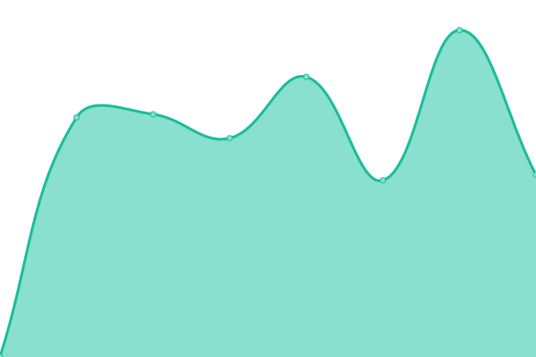
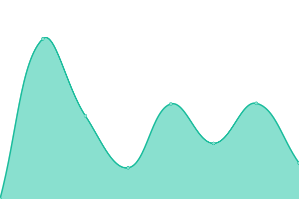
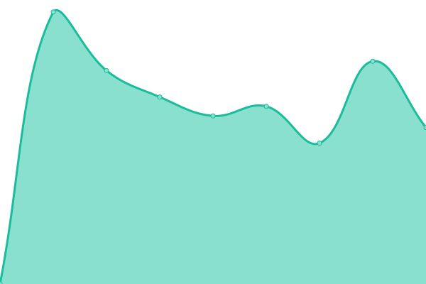

# [📈 Live Status](https://annkuoQ.github.io/upptime): <!--live status--> **🟧 Partial outage**

This repository contains the open-source uptime monitor and status page for [annkuoQ](https://annkuoq.github.io/blog/), powered by [Upptime](https://github.com/upptime/upptime).

With [Upptime](https://upptime.js.org), you can get your own unlimited and free uptime monitor and status page, powered entirely by a GitHub repository. We use [Issues](https://github.com/annkuoQ/upptime/issues) as incident reports, [Actions](https://github.com/annkuoQ/upptime/actions) as uptime monitors, and [Pages](https://annkuoQ.github.io/upptime) for the status page.

<!--start: status pages-->
<!-- This summary is generated by Upptime (https://github.com/upptime/upptime) -->
<!-- Do not edit this manually, your changes will be overwritten -->
<!-- prettier-ignore -->
| URL | Status | History | Response Time | Uptime |
| --- | ------ | ------- | ------------- | ------ |
|  [PTS](https://www.pts.org.tw/) | 🟩 正常 | [pts.yml](https://github.com/annkuoQ/upptime/commits/HEAD/history/pts.yml) | 

 2052ms
     
 | 

<a href="https://annkuoQ.github.io/upptime/history/pts">99.22%</a>
    

|  [PTS Taigi](https://taigi.pts.org.tw/) | 🟩 正常 | [pts-taigi.yml](https://github.com/annkuoQ/upptime/commits/HEAD/history/pts-taigi.yml) | 

 1346ms
     
 | 

<a href="https://annkuoQ.github.io/upptime/history/pts-taigi">100.00%</a>
    

|  [PTS 3](http://pts_3.pts.org.tw/) | 🟥 Down | [pts-3.yml](https://github.com/annkuoQ/upptime/commits/HEAD/history/pts-3.yml) | 

 831ms
     
 | 

<a href="https://annkuoQ.github.io/upptime/history/pts-3">100.00%</a>
    

|  [PTS ENG](http://eng.pts.org.tw/) | 🟩 正常 | [pts-eng.yml](https://github.com/annkuoQ/upptime/commits/HEAD/history/pts-eng.yml) | 

 355ms
     
 | 

<a href="https://annkuoQ.github.io/upptime/history/pts-eng">100.00%</a>
    

|  [TV schedule](http://web.pts.org.tw/php/programX/main.php) | 🟩 正常 | [tv-schedule.yml](https://github.com/annkuoQ/upptime/commits/HEAD/history/tv-schedule.yml) | 

 769ms
     
 | 

<a href="https://annkuoQ.github.io/upptime/history/tv-schedule">99.75%</a>
    

|  [PTS News](https://news.pts.org.tw/) | 🟩 正常 | [pts-news.yml](https://github.com/annkuoQ/upptime/commits/HEAD/history/pts-news.yml) | 

 4828ms
     
 | 

<a href="https://annkuoQ.github.io/upptime/history/pts-news">73.41%</a>
    

|  [PeoPo News](https://www.peopo.org/) | 🟩 正常 | [peo-po-news.yml](https://github.com/annkuoQ/upptime/commits/HEAD/history/peo-po-news.yml) | 

 1808ms
     
 | 

<a href="https://annkuoQ.github.io/upptime/history/peo-po-news">100.00%</a>
    

|  [PTS PLUS](https://www.ptsplus.tv/) | 🟩 正常 | [pts-plus.yml](https://github.com/annkuoQ/upptime/commits/HEAD/history/pts-plus.yml) | 

 460ms
     
 | 

<a href="https://annkuoQ.github.io/upptime/history/pts-plus">100.00%</a>
    

|  [PTS 4K](https://4k.pts.org.tw/) | 🟩 正常 | [pts-4-k.yml](https://github.com/annkuoQ/upptime/commits/HEAD/history/pts-4-k.yml) | 

 1852ms
     
 | 

<a href="https://annkuoQ.github.io/upptime/history/pts-4-k">99.84%</a>
    

|  [PTS Shop](https://shop.pts.org.tw/) | 🟩 正常 | [pts-shop.yml](https://github.com/annkuoQ/upptime/commits/HEAD/history/pts-shop.yml) | 

 1818ms
     
 | 

<a href="https://annkuoQ.github.io/upptime/history/pts-shop">99.84%</a>
    

|  [PTS Friend](https://friends.pts.org.tw/) | 🟩 正常 | [pts-friend.yml](https://github.com/annkuoQ/upptime/commits/HEAD/history/pts-friend.yml) | 

 1152ms
     
 | 

<a href="https://annkuoQ.github.io/upptime/history/pts-friend">99.75%</a>
    

|  [AnnKuoQ Blog](https://annkuoq.github.io/blog/) | 🟩 正常 | [ann-kuo-q-blog.yml](https://github.com/annkuoQ/upptime/commits/HEAD/history/ann-kuo-q-blog.yml) | 

 140ms
     
 | 

<a href="https://annkuoQ.github.io/upptime/history/ann-kuo-q-blog">100.00%</a>
    

|  [LINE TV](https://www.linetv.tw/) | 🟩 正常 | [line-tv.yml](https://github.com/annkuoQ/upptime/commits/HEAD/history/line-tv.yml) | 

 463ms
     
 | 

<a href="https://annkuoQ.github.io/upptime/history/line-tv">100.00%</a>
    

|  [Gamer](https://ani.gamer.com.tw/) | 🟩 正常 | [gamer.yml](https://github.com/annkuoQ/upptime/commits/HEAD/history/gamer.yml) | 

 1168ms
     
 | 

<a href="https://annkuoQ.github.io/upptime/history/gamer">100.00%</a>
    

|  [Netflix TW](https://www.netflix.com/tw/) | 🟩 正常 | [netflix-tw.yml](https://github.com/annkuoQ/upptime/commits/HEAD/history/netflix-tw.yml) | 

 1035ms
     
 | 

<a href="https://annkuoQ.github.io/upptime/history/netflix-tw">100.00%</a>
    

|  [KKTV](https://www.kktv.me/) | 🟩 正常 | [kktv.yml](https://github.com/annkuoQ/upptime/commits/HEAD/history/kktv.yml) | 

 1783ms
     
 | 

<a href="https://annkuoQ.github.io/upptime/history/kktv">100.00%</a>
    

|  [friDay](https://video.friday.tw/) | 🟩 正常 | [fri-day.yml](https://github.com/annkuoQ/upptime/commits/HEAD/history/fri-day.yml) | 

 1601ms
     
 | 

<a href="https://annkuoQ.github.io/upptime/history/fri-day">100.00%</a>
    

|  [CATCHPLAY+](https://www.catchplay.com/tw/home) | 🟩 正常 | [catchplay.yml](https://github.com/annkuoQ/upptime/commits/HEAD/history/catchplay.yml) | 

 1728ms
     
 | 

<a href="https://annkuoQ.github.io/upptime/history/catchplay">100.00%</a>
    

|  [myVideo](https://www.myvideo.net.tw/) | 🟩 正常 | [my-video.yml](https://github.com/annkuoQ/upptime/commits/HEAD/history/my-video.yml) | 

 1588ms
     
 | 

<a href="https://annkuoQ.github.io/upptime/history/my-video">100.00%</a>
    

<!--end: status pages-->

[**Visit our status website →**](https://annkuoQ.github.io/upptime)

## 📄 License

- Powered by: [Upptime](https://github.com/upptime/upptime)
- Code: [MIT](./LICENSE) © [annkuoQ](https://annkuoq.github.io/blog/)
- Data in the `./history` directory: [Open Database License](https://opendatacommons.org/licenses/odbl/1-0/)
