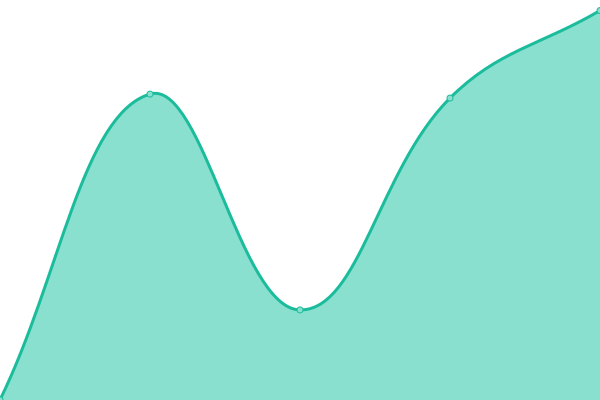

# [📈 Live Status](https://annkuoQ.github.io/upptime): <!--live status--> **🟩 All systems operational**

This repository contains the open-source uptime monitor and status page for [annkuoQ](https://annkuoq.github.io/blog/), powered by [Upptime](https://github.com/upptime/upptime).

With [Upptime](https://upptime.js.org), you can get your own unlimited and free uptime monitor and status page, powered entirely by a GitHub repository. We use [Issues](https://github.com/annkuoQ/upptime/issues) as incident reports, [Actions](https://github.com/annkuoQ/upptime/actions) as uptime monitors, and [Pages](https://annkuoQ.github.io/upptime) for the status page.

<!--start: status pages-->
<!-- This summary is generated by Upptime (https://github.com/upptime/upptime) -->
<!-- Do not edit this manually, your changes will be overwritten -->
<!-- prettier-ignore -->
| URL | Status | History | Response Time | Uptime |
| --- | ------ | ------- | ------------- | ------ |
|  [AnnKuoQ Blog](https://annkuoq.github.io/blog/) | 🟩 Up | [ann-kuo-q-blog.yml](https://github.com/annkuoQ/upptime/commits/master/history/ann-kuo-q-blog.yml) | 

 146ms
     
 | 

<a href="https://annkuoQ.github.io/upptime/history/ann-kuo-q-blog">100.00%</a>
    

|  [P公共電視](https://www.pts.org.tw/) | 🟩 Up | [p.yml](https://github.com/annkuoQ/upptime/commits/master/history/p.yml) | 

 1699ms
     
 | 

<a href="https://annkuoQ.github.io/upptime/history/p">100.00%</a>
    

|  [P公視+](https://www.ptsplus.tv/) | 🟩 Up | [p.yml](https://github.com/annkuoQ/upptime/commits/master/history/p.yml) | 

 1699ms
     
 | 

<a href="https://annkuoQ.github.io/upptime/history/p">100.00%</a>
    

|  [P公視新聞網](https://news.pts.org.tw/) | 🟩 Up | [p.yml](https://github.com/annkuoQ/upptime/commits/master/history/p.yml) | 

 1699ms
     
 | 

<a href="https://annkuoQ.github.io/upptime/history/p">100.00%</a>
    

|  [PeoPo 公民新聞](https://www.peopo.org/) | 🟩 Up | [peo-po.yml](https://github.com/annkuoQ/upptime/commits/master/history/peo-po.yml) | 

 1915ms
     
 | 

<a href="https://annkuoQ.github.io/upptime/history/peo-po">100.00%</a>
    

|  [P公視之友](https://friends.pts.org.tw/) | 🟩 Up | [p.yml](https://github.com/annkuoQ/upptime/commits/master/history/p.yml) | 

 1699ms
     
 | 

<a href="https://annkuoQ.github.io/upptime/history/p">100.00%</a>
    

|  [KKTV](https://www.kktv.me/) | 🟩 Up | [kktv.yml](https://github.com/annkuoQ/upptime/commits/master/history/kktv.yml) | 

 1551ms
     
 | 

<a href="https://annkuoQ.github.io/upptime/history/kktv">100.00%</a>
    

|  [G巴哈姆特動畫瘋](https://ani.gamer.com.tw/) | 🟩 Up | [g.yml](https://github.com/annkuoQ/upptime/commits/master/history/g.yml) | 

 337ms
     
 | 

<a href="https://annkuoQ.github.io/upptime/history/g">100.00%</a>
    

|  [LINE TV](https://www.linetv.tw/) | 🟩 Up | [line-tv.yml](https://github.com/annkuoQ/upptime/commits/master/history/line-tv.yml) | 

 239ms
     
 | 

<a href="https://annkuoQ.github.io/upptime/history/line-tv">100.00%</a>
    

|  [CATCHPLAY+](https://www.catchplay.com/tw/home) | 🟩 Up | [catchplay.yml](https://github.com/annkuoQ/upptime/commits/master/history/catchplay.yml) | 

 1975ms
     
 | 

<a href="https://annkuoQ.github.io/upptime/history/catchplay">100.00%</a>
    

|  [Netflix 台灣](https://www.netflix.com/tw/) | 🟩 Up | [netflix.yml](https://github.com/annkuoQ/upptime/commits/master/history/netflix.yml) | 

 1166ms
     
 | 

<a href="https://annkuoQ.github.io/upptime/history/netflix">100.00%</a>
    

|  [myVideo](https://www.myvideo.net.tw/) | 🟩 Up | [my-video.yml](https://github.com/annkuoQ/upptime/commits/master/history/my-video.yml) | 

 2499ms
     
 | 

<a href="https://annkuoQ.github.io/upptime/history/my-video">100.00%</a>
    

|  [friDay](https://video.friday.tw/) | 🟩 Up | [fri-day.yml](https://github.com/annkuoQ/upptime/commits/master/history/fri-day.yml) | 

 1897ms
     
 | 

<a href="https://annkuoQ.github.io/upptime/history/fri-day">100.00%</a>
    

<!--end: status pages-->

[**Visit our status website →**](https://annkuoQ.github.io/upptime)

## 📄 License

- Powered by: [Upptime](https://github.com/upptime/upptime)
- Code: [MIT](./LICENSE) © [annkuoQ](https://annkuoq.github.io/blog/)
- Data in the `./history` directory: [Open Database License](https://opendatacommons.org/licenses/odbl/1-0/)
